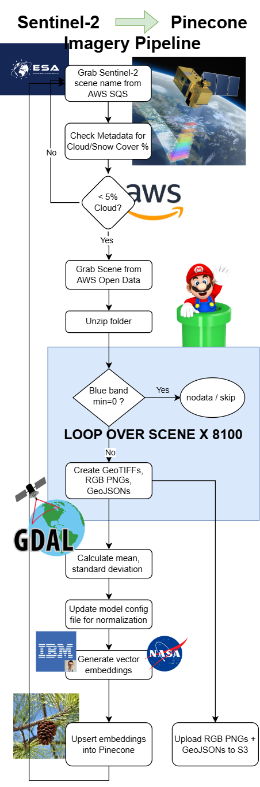

## Sentinel 2 -> Pinecone Imagery Pipeline


You will need an AWS account for this to work, and there are some additional packages to install on top of the RSIR installation. 

A newer version of GDAL is needed. JQ, BC, Pinecone and others as well.

If you are running Ubuntu, use the [UbuntuGIS Unstable PPA](https://launchpad.net/~ubuntugis/+archive/ubuntu/ubuntugis-unstable) to install GDAL prior to running `sudo apt-get install GDAL` and grabbing an old version.

The pipeline is in `pipeline.sh` and the inference takes place in `inference_tampanet.py`.

Please reach out with questions.

## Citations for RSIR, BigEarthNet, and GDAL

```text
@article{RSIR2024,
  title={{Multi-Spectral Remote Sensing Image Retrieval using Geospatial Foundation Models}},
  author={Blumenstiel, Benedikt and Moor, Viktoria and Kienzler, Romeo and Brunschwiler, Thomas},
  journal={arXiv preprint arXiv:2403.02059},
  year={2024}
}

@misc{clasen2024rebenrefinedbigearthnetdataset,
      title={reBEN: Refined BigEarthNet Dataset for Remote Sensing Image Analysis}, 
      author={Kai Norman Clasen and Leonard Hackel and Tom Burgert and Gencer Sumbul and Begüm Demir and Volker Markl},
      year={2024},
      eprint={2407.03653},
      archivePrefix={arXiv},
      primaryClass={cs.CV},
      url={https://arxiv.org/abs/2407.03653}, 
}

Rouault, E., Warmerdam, F., Schwehr, K., Kiselev, A., Butler, H., Łoskot, M., Szekeres, T., Tourigny, E., Landa, M., Miara, I., Elliston, B., Chaitanya, K., Plesea, L., Morissette, D., Jolma, A., Dawson, N., Baston, D., de Stigter, C., & Miura, H. (2024). GDAL (v3.9.1). Zenodo. https://doi.org/10.5281/zenodo.12545688
```


