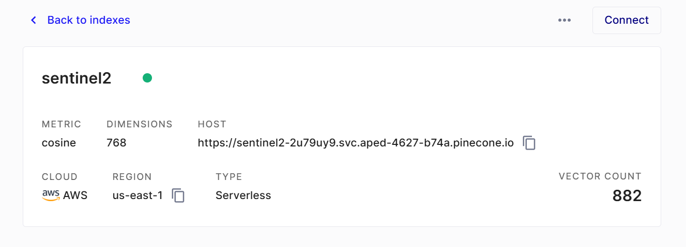

## Sentinel 2 -> Pinecone Imagery Pipeline




You will need an AWS account for this to work, and there are some additional packages to install on top of the RSIR installation. 

A newer version of GDAL is needed. JQ, BC, Pinecone and others packages are needed as well. This was more of a sandbox proof of concept, so documentation is scant.

If you are running Ubuntu, use the [UbuntuGIS Unstable PPA](https://launchpad.net/~ubuntugis/+archive/ubuntu/ubuntugis-unstable) to install GDAL prior to running `sudo apt-get install GDAL` and grabbing an old version.

The pipeline is in `pipeline.sh` and the inference takes place in `inference_tampanet.py`.

The latest PR is broken and will need some minor bug fixes should you decide to fire this up. Troubleshooting this script is very time consuming and is not worth it for me, but it proves the concept. PRs very very welcome. 

Results would be rather boring with things as-is. Lots of cloud, lots of water. Perhaps a Sentinel-2 guru could spice it up.

Please reach out with questions.

## Citations for RSIR, BigEarthNet, and GDAL

```text
@article{RSIR2024,
  title={{Multi-Spectral Remote Sensing Image Retrieval using Geospatial Foundation Models}},
  author={Blumenstiel, Benedikt and Moor, Viktoria and Kienzler, Romeo and Brunschwiler, Thomas},
  journal={arXiv preprint arXiv:2403.02059},
  year={2024}
}

@misc{clasen2024rebenrefinedbigearthnetdataset,
      title={reBEN: Refined BigEarthNet Dataset for Remote Sensing Image Analysis}, 
      author={Kai Norman Clasen and Leonard Hackel and Tom Burgert and Gencer Sumbul and Begüm Demir and Volker Markl},
      year={2024},
      eprint={2407.03653},
      archivePrefix={arXiv},
      primaryClass={cs.CV},
      url={https://arxiv.org/abs/2407.03653}, 
}

Rouault, E., Warmerdam, F., Schwehr, K., Kiselev, A., Butler, H., Łoskot, M., Szekeres, T., Tourigny, E., Landa, M., Miara, I., Elliston, B., Chaitanya, K., Plesea, L., Morissette, D., Jolma, A., Dawson, N., Baston, D., de Stigter, C., & Miura, H. (2024). GDAL (v3.9.1). Zenodo. https://doi.org/10.5281/zenodo.12545688

Sentinel-2 (ESA) image courtesy of the AWS Open Data.
```


